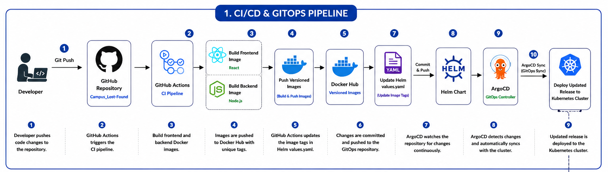
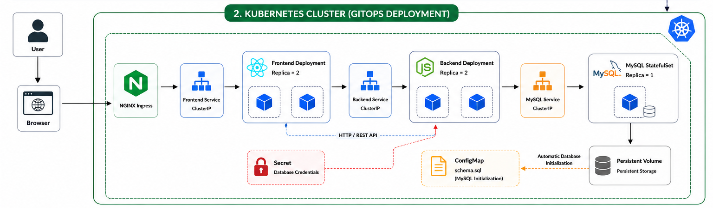
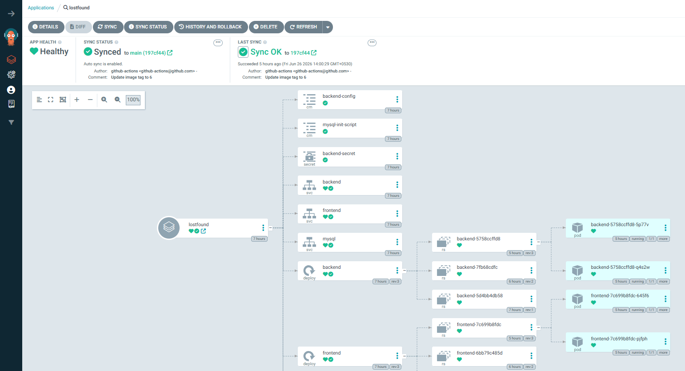
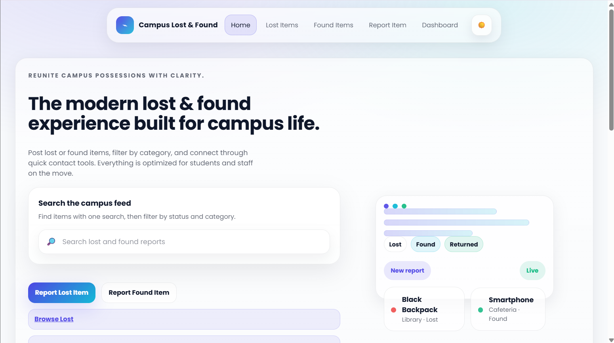

# 🚀 Campus Lost & Found - GitOps Deployment

A production-style GitOps repository that automates the deployment of the **Campus Lost & Found** application using **GitHub Actions, Docker, Helm, ArgoCD, and Kubernetes**.

This repository follows GitOps principles where every infrastructure and deployment change is managed through Git, enabling automated, consistent, and reliable deployments.

---

## 📌 Project Overview

This repository contains the Kubernetes deployment configuration for the **Campus Lost & Found** application.

Whenever changes are pushed to the application repository:

1. GitHub Actions builds Docker images.
2. Images are pushed to Docker Hub.
3. GitHub Actions updates the image tags in this GitOps repository.
4. ArgoCD detects the changes.
5. ArgoCD automatically synchronizes the Kubernetes cluster.
6. The latest version of the application is deployed without manual intervention.

---

# 🏗️ CI/CD & GitOps Architecture



---

# ☸️ Kubernetes Deployment Architecture



---

# ⚙️ CI/CD Workflow

```text
Developer
    │
    ▼
Git Push
    │
    ▼
GitHub Repository
    │
    ▼
GitHub Actions
    │
    ▼
Build Frontend Image
    │
    ▼
Build Backend Image
    │
    ▼
Push Images to Docker Hub
    │
    ▼
Update values.yaml
    │
    ▼
Commit & Push GitOps Repository
    │
    ▼
ArgoCD detects changes
    │
    ▼
Automatic Sync
    │
    ▼
Deploy to Kubernetes Cluster
```

---

# ☸️ Kubernetes Components

The Kubernetes cluster consists of the following resources:

- **NGINX Ingress** – Routes external traffic to the frontend service.
- **Frontend Deployment** – Runs multiple React frontend pods.
- **Frontend Service** – Exposes the frontend deployment internally.
- **Backend Deployment** – Runs multiple Node.js backend pods.
- **Backend Service** – Exposes the backend deployment internally.
- **MySQL StatefulSet** – Provides persistent database storage.
- **MySQL Service** – Internal service for database communication.
- **Persistent Volume** – Stores MySQL data permanently.
- **ConfigMap** – Automatically initializes the database using `schema.sql`.
- **Secret** – Stores sensitive database credentials securely.

---

# 📁 Repository Structure

```text
Campus_Lost-Found-GitOps
│
├── lostfound-chart
│   ├── templates
│   │   ├── backend-configmap.yaml
│   │   ├── backend-deployment.yaml
│   │   ├── backend-secret.yaml
│   │   ├── backend-service.yaml
│   │   ├── frontend-deployment.yaml
│   │   ├── frontend-service.yaml
│   │   ├── ingress.yaml
│   │   ├── mysql-init-configmap.yaml
│   │   ├── mysql-service.yaml
│   │   ├── mysql-statefulset.yaml
│   │   └── _helpers.tpl
│   │
│   ├── files
│   │   └── schema.sql
│   │
│   ├── Chart.yaml
│   └── values.yaml
│
├── screenshots
│
└── README.md
```

---

# 🛠️ Technologies Used

| Category | Technology |
| :--- | :--- |
| Source Control | Git, GitHub |
| CI | GitHub Actions |
| Containerization | Docker |
| Image Registry | Docker Hub |
| GitOps | ArgoCD |
| Package Manager | Helm |
| Container Orchestration | Kubernetes |
| Ingress Controller | NGINX Ingress |
| Database | MySQL 8 |
| Configuration | ConfigMaps |
| Secrets | Kubernetes Secrets |
| Storage | Persistent Volume |

---

# 🚀 Deployment Process

### Clone the GitOps Repository

```bash
git clone https://github.com/MEGHAAMANICKAM/Campus_Lost-Found-GitOps.git
```

---

### Deploy using Helm

```bash
helm install lostfound ./lostfound-chart
```

---

### Verify Resources

```bash
kubectl get all
```

---

### Check Persistent Volume

```bash
kubectl get pvc
```

---

### Check ArgoCD Application

```bash
kubectl get application -n argocd
```

---

# 📸 Deployment Screenshots

## ArgoCD Dashboard



---

## Application



---

# ✨ Key Features

- Fully Automated CI/CD Pipeline
- GitOps-Based Deployment
- Helm Chart Packaging
- ArgoCD Continuous Synchronization
- Automatic Docker Image Updates
- Kubernetes Secrets & ConfigMaps
- MySQL StatefulSet with Persistent Storage
- Automatic Database Initialization
- NGINX Ingress Routing
- Highly Modular Kubernetes Manifests

---

# 📈 Future Enhancements

- Horizontal Pod Autoscaler (HPA)
- Prometheus Monitoring
- Grafana Dashboard
- TLS using cert-manager
- External DNS
- Multi-Environment Deployments (Dev, Staging, Production)
- Canary Deployments
- Blue-Green Deployments

---

# 👩‍💻 Author

**Meghaa Manickam**

B.Tech Information Technology

DevOps | Cloud | Kubernetes | GitOps Enthusiast

---

## ⭐ If you found this project useful, consider giving it a star!